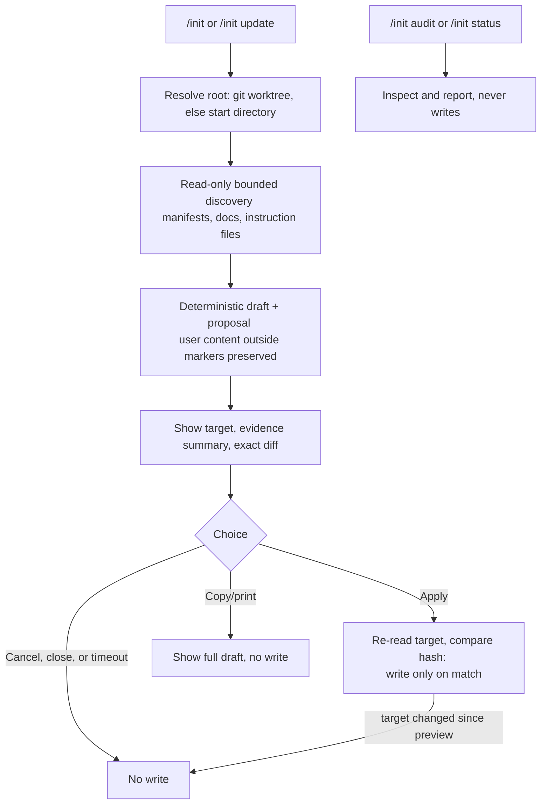

# pi-context-init

[](https://github.com/TheAkshitS/pi-context-init/actions/workflows/ci.yml) [](https://www.npmjs.com/package/pi-context-init)

Safe `/init` for [Pi](https://pi.dev) inspects the repository, drafts concise
evidence-backed project instructions, shows the exact diff, and writes only on
explicit approval.

Requires Pi >= 0.85.1 for extension command support through
`pi.registerCommand`. On an older Pi the extension refuses to load and tells you to update.

## Install

```bash
pi install npm:pi-context-init
```

You get `/init` plus the optional `repository-analysis` skill
(find it under `/skill:repository-analysis`). The skill advises on
writing concise instructions. The extension works without it.

If Pi reports a command-name collision, Pi assigns the invocation
name in load order. Run `/init` as Pi shows it, or filter the package
to this extension only.

## Use

Run inside a project directory:

- `/init` inspects the repository, proposes the target file, shows the evidence
  summary and exact diff, then offers Apply, Copy/print, or Cancel.
- `/init update` re-scans and proposes a minimal revision of the managed
  section after manifests change.
- `/init audit` reports instruction layering and precedence,
  marker validity, possibly-stale commands, conflicts, budget usage, stale
  references, and safe next actions. It never writes.
- `/init status` summarizes analysis root, discovered instruction
  files, chosen default target, and exclusions. It never writes.

The extension updates an existing `AGENTS.md`. In a
`CLAUDE.md`-only project you see `AGENTS.md` as the Pi-focused
alternative. The extension leaves `AGENTS.override.md` alone unless
you ask.
Managed content lives between `<!-- pi-init:begin -->` and
`<!-- pi-init:end -->`. The extension preserves everything outside byte-for-byte.

## How it works



You see the exact diff before Apply writes anything. Apply re-reads
the target first and aborts when the target changed since the preview.
Rerun `/init` in that case.

## Scope and privacy

- It runs locally. It sends no telemetry, fetches nothing from the network, and installs no dependencies.
  The extension runs one subprocess, a bounded read-only `git` query for
  root detection. It runs no project scripts during discovery.
- The extension caps reads by file count, per-file and total bytes, and search depth,
  and it skips `.git`, `node_modules`, build outputs, and lockfile internals. You see a note whenever a limit cuts the scan.
- The extension treats repository text as untrusted evidence. It redacts
  secret-looking values from previews and keeps them out of new content.
- The extension writes atomically (same-directory temp file plus rename)
  and re-checks the target first. If the target changed after the preview,
  the extension replaces nothing. Rerun `/init`.

## Uninstall

```bash
pi remove npm:pi-context-init
```

Run the command above to drop the `/init` command and the bundled skill.
The managed section in your `AGENTS.md` stays. Delete the text between
the markers yourself to remove it.

## License

MIT — see [LICENSE](LICENSE) and [CHANGELOG.md](CHANGELOG.md).

Developing? See [AGENTS.md](AGENTS.md) for the pnpm gates (`pnpm typecheck`, `pnpm lint`, `pnpm format:check`, `pnpm test`).
